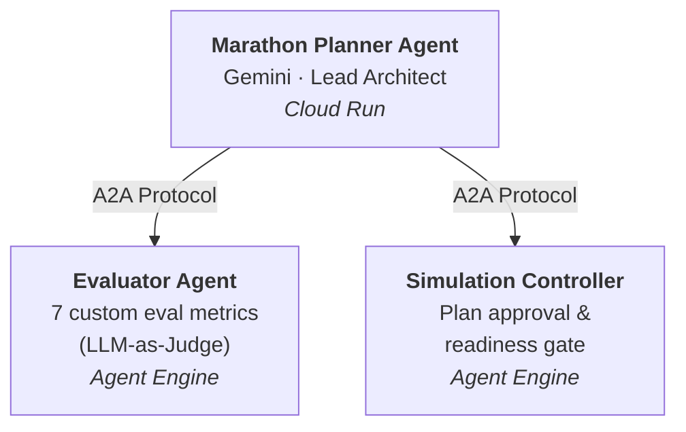
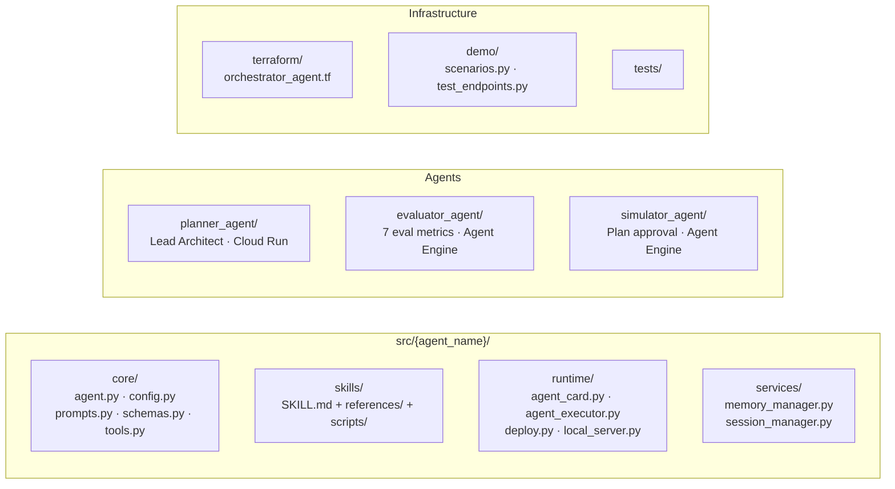

# Marathon Planning Multi-Agent System

A multi-agent system where AI agents collaborate to plan city marathons — designing routes, evaluating community impact, and scoring plan quality through structured evaluation.

## Architecture



## Agents

| Agent | Role | Model | Deployment |
|-------|------|-------|------------|
| **Marathon Planner** | Lead architect — designs plans with built-in skills, calls Evaluator + Simulation Controller via A2A | Gemini 3 Flash Preview | Cloud Run |
| **Evaluator** | Scores plans across 7 criteria using Vertex AI Eval | Gemini 3 Flash Preview | Agent Engine |
| **Simulation Controller** | Reviews plans for simulation readiness and formal approval | Gemini 3 Flash Preview | Agent Engine |

## Key Technologies

- **ADK (Agent Development Kit)** — Agent framework with structured outputs and ADK Skills
- **A2A (Agent-to-Agent Protocol)** — Inter-agent communication standard
- **Vertex AI Agent Engine** — Managed deployment for ADK agents
- **Memory Bank** — Cross-session learning with custom topics
- **ADK Skills** — Modular skill packages (SKILL.md + references/ + scripts/)
- **Custom Vertex AI Eval Metrics** — LLM-based and deterministic plan scoring
- **Gemini 3 Flash Preview** — All agents powered by Google's Gemini via Vertex AI

## Prerequisites

- Python 3.10+
- [uv](https://docs.astral.sh/uv/) package manager
- Google Cloud project with Vertex AI and Agent Engine APIs enabled
- Terraform (for Cloud Run deployment)

## Quick Start

A `Makefile` covers the full end-to-end workflow. Run `make help` to see all targets.

```bash
make setup          # Install deps + create .env
make auth           # Authenticate with Google Cloud
make test           # Run unit tests
make deploy         # Deploy everything (infra → agents → Cloud Run)
make demo-health    # Verify endpoints
make teardown       # Destroy all resources
```

## Setup

```bash
# 1. Install Python dependencies (requires uv)
make install        # or: uv sync --all-groups --extra dev

# 2. Configure environment
make env            # creates .env from .env.example
# Edit .env with your GOOGLE_CLOUD_PROJECT and GCP vars

# 3. Authenticate
make auth           # or: gcloud auth application-default login
```

## Deployment

```bash
# Full deploy (infrastructure + agents + Cloud Run)
make deploy

# Or step by step:
make infra              # Terraform: bucket, IAM, Artifact Registry, Cloud Run
make deploy-simulator   # Deploy Simulator Agent to Agent Engine
make deploy-planner     # Build + deploy Planner to Cloud Run via Cloud Build
```

## Demo

Two demo modes showcase the before/after of multi-agent collaboration:

| Mode | Description |
|------|-------------|
| **Solo** | Planner + Evaluator only — scores and iterates on plan quality |
| **Full Team** | Planner + Evaluator + Simulation Controller — full approval flow |

```bash
make demo-health    # Health check deployed endpoints
make demo-solo      # Solo mode
make demo-full      # Full team mode
make demo-all       # Both modes
```

## Development

### Running Locally

```bash
make local-planner      # Planner Agent on port 8084
make local-simulator    # Simulator Agent on port 8089
make local-full         # Both agents, connected via A2A
```

To connect the Marathon Planner to a locally running Simulator instead of Agent Engine, set the resource name env var to `local:PORT`:

```bash
SIMULATOR_AGENT_RESOURCE_NAME=local:8089 uv run python -m src.planner_agent.runtime.local_server
```

### Testing

```bash
make test           # Run all unit tests
make test-verbose   # Verbose output
make lint           # Run linter
```

## Teardown

```bash
make teardown           # Destroy all resources (agents + infra)
make teardown-agents    # Delete agents from Agent Engine only
make teardown-infra     # Destroy Terraform infrastructure only
make clean              # Remove local build artifacts
```

## Project Structure

Each agent follows a standardized subpackage layout:



## License

Apache 2.0
